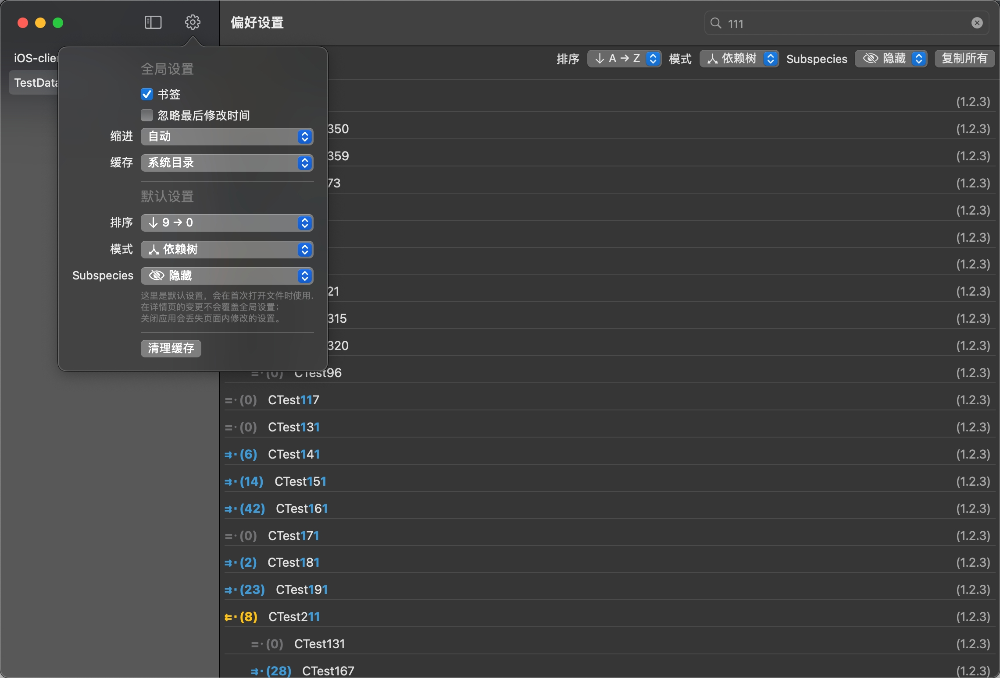

# Aquarius
[中文版](https://github.com/CrazyFanFan/Aquarius/blob/master/README_CN.md)

A tool to obtain dependencies by analyzing "Podfile.lock"

## Environment

- Xcode: version ≥ Xcode12-beta1
- OSX: version ≥ 10.16-beta1

## Preview


## Usage
- clone this repo
- open **Aquarius.xcodeproj** by Xcode(Version >= 11.0)
- `Command` + `R`, after resolve  Swift Packges

```shell
git clone https://github.com/CrazyFanFan/Aquarius.git
cd Aquarius
open Aquarius.xcodeproj
```

## Author
Crazy凡, [ccrazyfan@gmail.com](mailto:ccrazyfan@gmail.com)

## License
Aquarius is released under the MIT license. See [LICENSE](https://github.com/CrazyFanFan/Aquarius/blob/master/LICENSE) for details.
