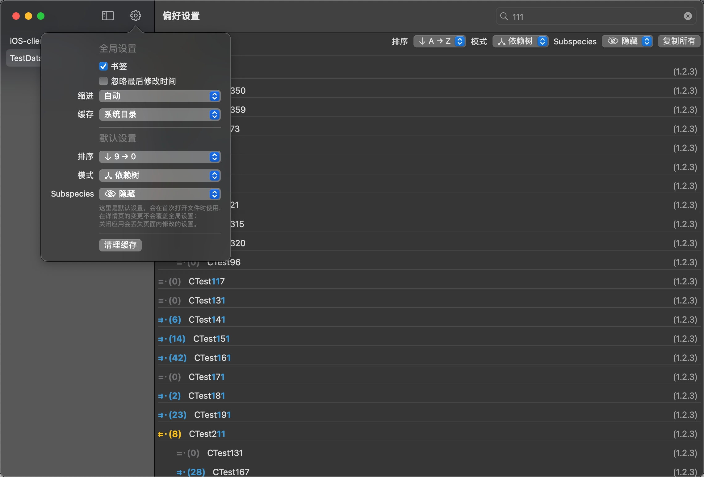

# Aquarius

[](https://github.com/CrazyFanFan/Aquarius/actions/workflows/xcodebuild.yml)

[English](https://github.com/CrazyFanFan/Aquarius/blob/master/README.md)

一个通过分析"Podfile.lock"获取各个库之间的依赖关系的工具。

## 机器翻译

> :warning: **英文版的 README 和应用中的英文都是机器翻译的结果，如有错误请斧正。**

支持以下操作：

- “依赖树”分析；
- “影响树”分析；
- 搜索
- 复制

"影响树"并非通用概念，而是我暂时这么称呼一种影响关系；有了解更好的名字的，欢迎留言。自上而下的看Podfile.lock记录了各模块之间的依赖关系；反之，自下而上的看，则可以推出每个库的变更最大的影响范围，我将其称之为"影响树"。其中根节点是变动的库，其子节点是依赖库的所有库，递归下去即可得到"影响树"。

## 环境

- Xcode: 版本 ≥ Xcode16.0 (Task.detached 在更低版本有运行时问题)
- OSX: 版本 ≥ 14.0

## 预览



## 使用

- 克隆这个仓库
- 打开 **Aquarius.xcodeproj**
- 等待“Swift Packages”处理完， 按下`Command` + `R`即可。

```shell
git clone https://github.com/CrazyFanFan/Aquarius.git
cd Aquarius
open Aquarius.xcodeproj
```

## 修改日志

### [2025-03-26]

- **功能**
  - 支持多栏列表布局
  - 支持查找两个Pod之间的依赖路径
- **优化**
  - 优化了完整依赖树的复制操作

### [2022-11-18]

- **功能**
  - 搜索支持简单的模糊匹配和高亮。
- 其他
  - 修改了少量文本颜色。

### [2020-11-30]

- 支持自定义排序.
- 使用 CoreData 存储书签.
- 支持打开多文件.
- 支持将文件拖动到图标上打开.
- 一些UI细节改动.


## 作者

Crazy凡, [ccrazyfan@gmail.com](mailto:ccrazyfan@gmail.com)

## License

[LICENSE](https://github.com/CrazyFanFan/Aquarius/blob/master/LICENSE)

附加条款:
- **本软件不得用于商业用途。** 商业目的包括但不限于销售本软件的副本，使用本软件提供有偿服务，或将本软件包含在拟出售的产品或服务中。
- **本软件不得通过任何应用程序商店或其他商业分发渠道分发。**
